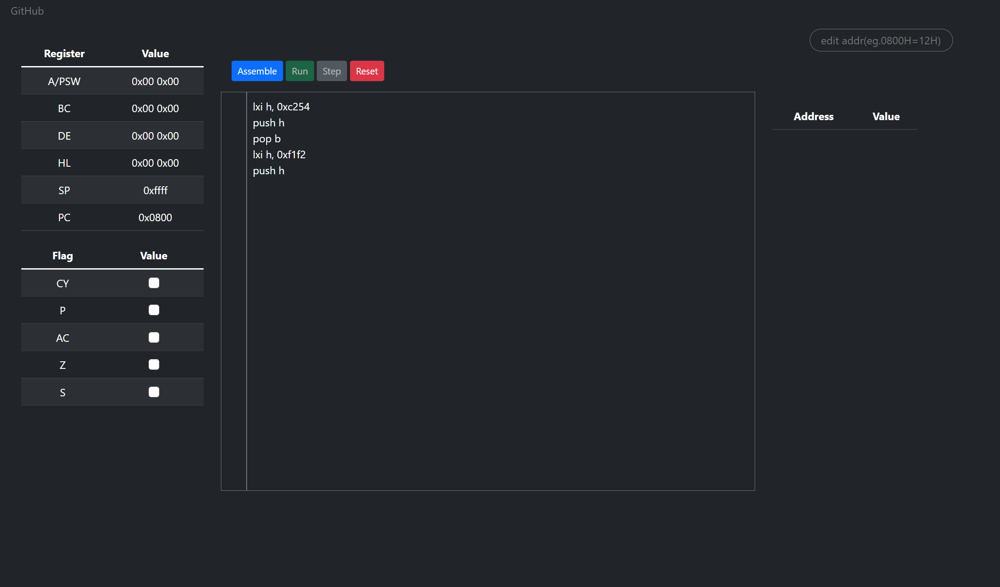
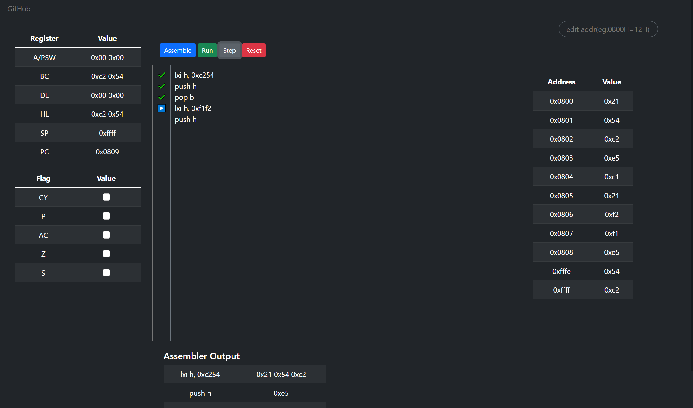

==============
8085 Simulator
==============

|build| |license| |doi|

A project for python based 8085 microprocessor simulator

Deployed at `8085 Simulator <https://sim-8085.herokuapp.com/>`_

.. |doi| image:: https://zenodo.org/badge/456430367.svg
       :target: https://zenodo.org/badge/latestdoi/456430367
       :alt: doi 
.. |build| image:: https://github.com/devanshshukla99/8085_Simulator/actions/workflows/build.yml/badge.svg
    :target: https://github.com/devanshshukla99/8085_Simulator/actions/workflows/build.yml
    :alt: build
.. |license| image:: https://img.shields.io/badge/license-MIT-blue.svg
    :alt: License
